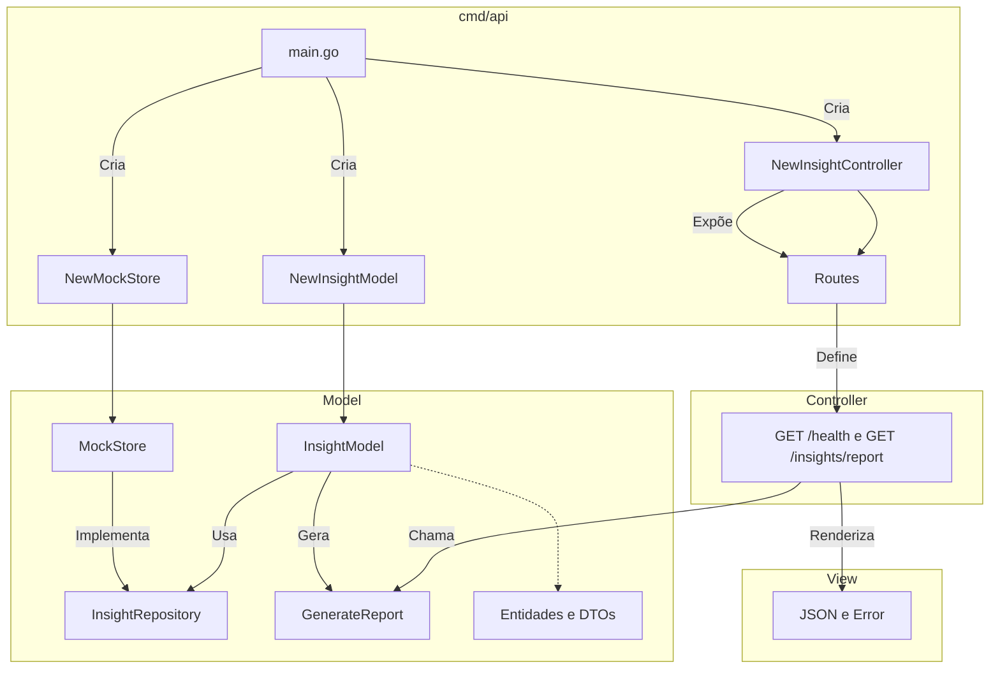

# API de Insights

API Go simples para gerar um relatório de insights a partir de mocks de vendas, sugestões, reclamações e dados captados dos usuários.

## Arquitetura

- `cmd/api`: composição da aplicação e servidor HTTP.
- `internal/model`: entidades, repositório mock, normalização e geração do relatório.
- `internal/controller`: rotas HTTP e orquestração das requisições.
- `internal/view`: renderização das respostas JSON.

### Diagrama Arquitetural



## Rodando

```bash
go run ./cmd/api
```

Endpoints:

- `GET /health`
- `GET /insights/report`

## Testes

```bash
go test ./...
go test -race ./...
```
