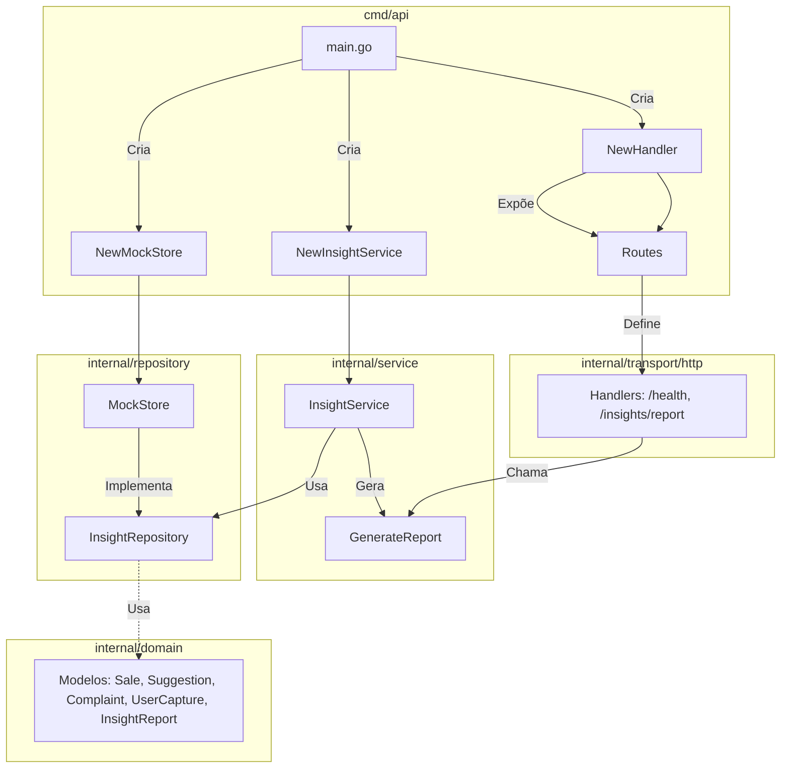

# API de Insights

API Go simples para gerar um relatório de insights a partir de mocks de vendas, sugestões, reclamações e dados captados dos usuários.

## Arquitetura

- `cmd/api`: composição da aplicação e servidor HTTP.
- `internal/domain`: modelos de domínio e DTO do relatório.
- `internal/repository`: mock simulando banco de dados, protegido com `sync.RWMutex` e cópias defensivas.
- `internal/service`: normalização, tratamento de dados, geração de insights e uso de goroutines.
- `internal/transport/http`: handlers HTTP.

### Diagrama Arquitetural



## Rodando

```bash
go run ./cmd/api
```

Endpoints:

- `GET /health`
- `GET /insights/report`

## Testes

```bash
go test ./...
go test -race ./...
```
